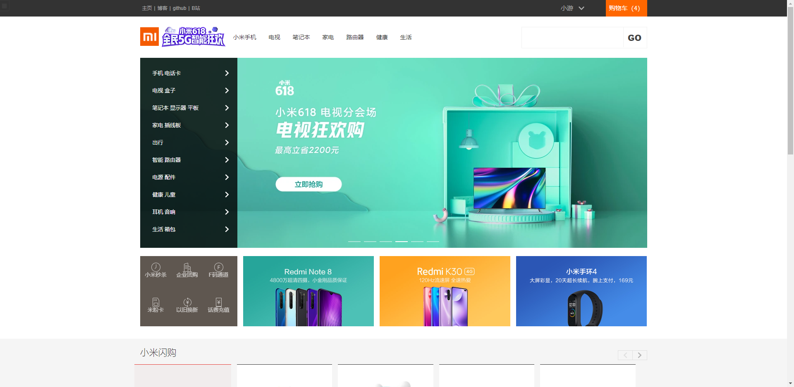
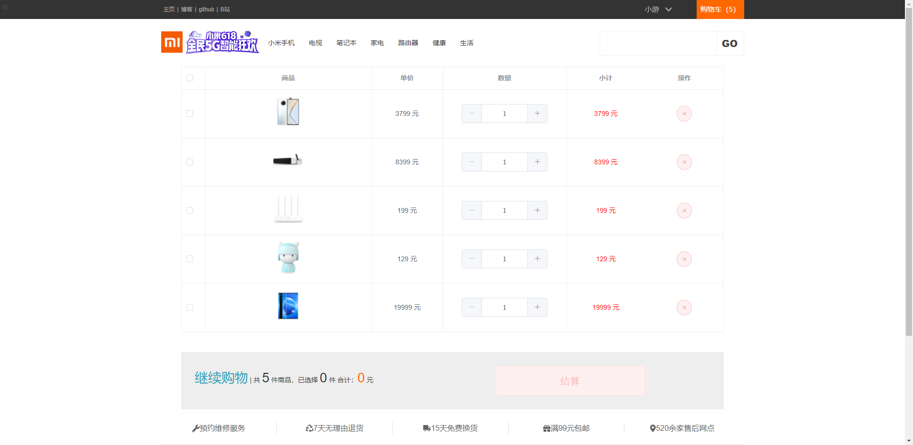
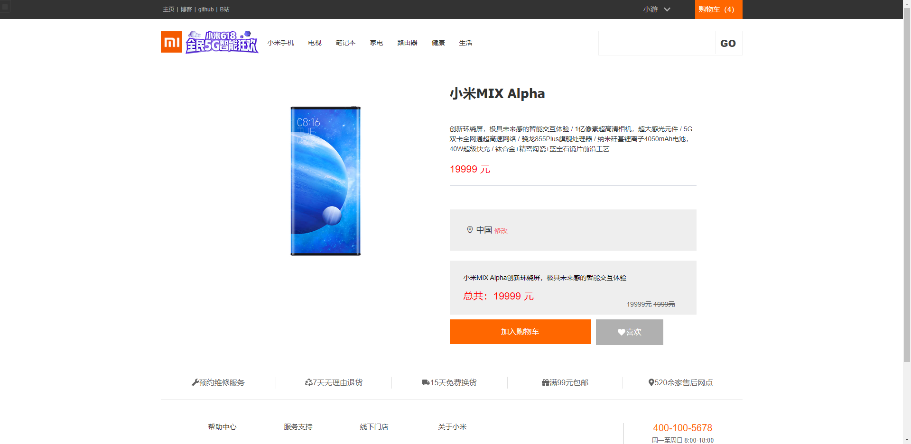
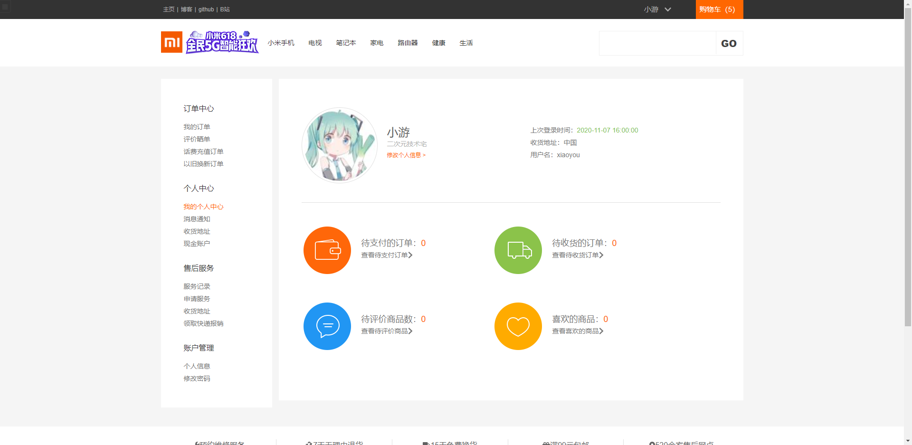

# 高仿小米商城

## 界面截图

## 如何部署

### 前端

1.先下载前端源码https://github.com/xiaoyou-project/javaweb-xshop

2.前端源码直接用webstorm打开下载npm依赖就可以了（前端用vue写的）

3.服务地址在`/src/util/global.js`里面，如果要部署到服务器上的话需要自己改一下

### 后端

1.下载本仓库的源码

2.后端用springboot写的，所以只需要用idea打开就可以了

3.下载好依赖就可以直接启动

4.数据库的配置文件在`/src/main/resource/applocation.yml`里面

5.数据库脚本就在本仓库的根目录下

### 账号密码
前端
账号:xiaoyou
密码:123
后台
账号:admin
密码:123

前端默认访问地址:http://localhost:8080/

后端默认访问地址:http://localhost:2333/

